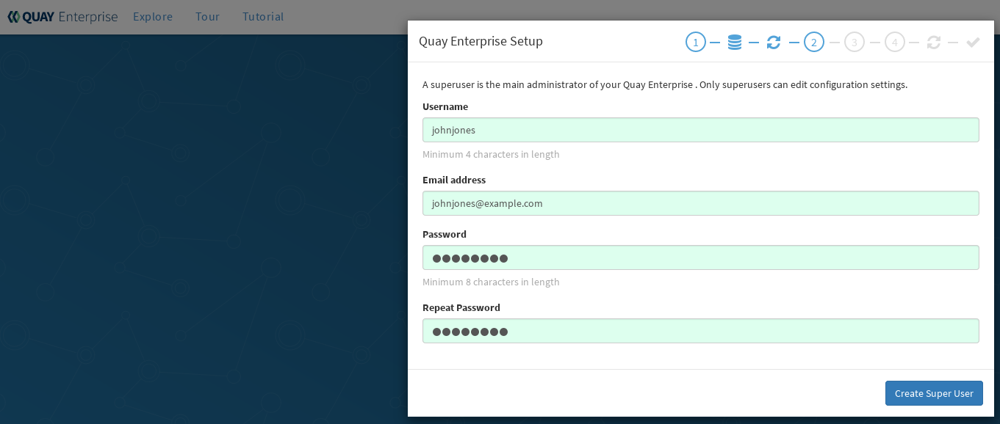

= Overview

Red Hat Quay is an enterprise-quality container registry. Use Quay to build and store containers, then deploy them to the servers across your enterprise. Features of Quay include:

* High availability
* Geo-replication
* Continuous integration
* Security scanning
* Custom log rotation
* 24/7 support

Quay provides support for multiple:

* Authentication and access methods
* Storage backends
* SSL certificates
* Application registries

Quay configurations can be built for non-production, test-only setups or full-blown enterprise-quality, high availability configurations.

= Architecture

Quay is made up of three core components for a basic setup. In highly available setups, an additional object storage component is needed. The three core components are: 

* **Database (MySQL or PostgreSQL)**: Used by Quay as its primary metadata storage (not for image storage).
* **Redis (key, value store)**: Used for providing real time events and during Quay setup and installation.
* **Quay (container registry)**: Runs Quay as a service, consisting of several components in the pod.

An optional fourth component is for storing images. The basic procedure simply uses the local hard disk. For the high availability installation, you need to use one of the following types of storage:

* **Public cloud storage**: In public cloud environments, you should use the cloud provider's object storage, such as Amazon S3 (for AWS) or Google Cloud Storage (for Google Cloud).

* **Private cloud storage**: In private clouds, an S3 or Swift compliant Object Store is needed, such as Ceph RADOS, or OpenStack Swift.

This getting started guide provides two different ways of setting up Red Hat Quay on Red Hat Enterprise Linux, both of which are based on Quay upstream documents:

* Set up Red Hat Quay (Basic) - Available here now (based on link:https://coreos.com/quay-enterprise/docs/latest/initial-setup.html[For Testing as a container]).
* Set up Red Hat Quay (High Availability) - Soon to come (based on link:https://coreos.com/quay-enterprise/docs/latest/high-availability.html[High Availability for Quay Enterprise])

= Installing Red Hat Quay (basic)

== Prerequisites

For a basic Red Hat Quay Registry installation (appropriate for testing purposes and personal use), you need one virtual machine that has the following attributes:

* **Red Hat Enterprise Linux (RHEL)**: Obtain the latest Red Hat Enterprise Linux server media from the link:https://access.redhat.com/downloads/content/69/ver=/rhel---7/7.5/x86_64/product-software[Downloads page] and follow instructions from the link:https://access.redhat.com/documentation/en-us/red_hat_enterprise_linux/7/html-single/installation_guide/index[Red Hat Enterprise Linux 7 Installation Guide].
* **Valid Red Hat Subscription**: Obtain a valid Red Hat Enterprise Linux server subscription. 
* **CPUs**: Two virtual CPUs
* **RAM**: 8192MB (roughly only 4029MB is needed for Red Hat Quay; the rest is for overhead and CEPH)
* **Disk space**:  About 30GB of disk space should be enough for a test system:

    - About 10GB of disk space for the operating system (Red Hat Enterprise Linux Server).
    - At least 10GB of disk space for docker storage
    - At least 10GB of disk space for Quay local storage (CEPH or other local storage might require more memory)

* **docker service**: Install and enable the link:https://access.redhat.com/documentation/en-us/red_hat_enterprise_linux_atomic_host/7/html-single/getting_started_with_containers/index#getting_docker_in_rhel_7[docker service].

* **CoreOS License**: A valid (CoreOS) license is required to run Red Hat Quay. Find a license at link:https://account.tectonic.com/?_ga=2.89691474.855634678.1524488291-1499321380.1523978881[Tectonic Accounts]. 

== Starting up the services
Follow these steps to install Red Hat Quay on a single system (VM or bare metal).

1. **Install Red Hat Enterprise Linux server**: Install the latest RHEL server. You can do a Minimal install (shell access only) or Server plus GUI (if you want a desktop).
1. **Register the System**: Register and subscribe your RHEL server system to Red Hat. See link:https://access.redhat.com/solutions/253273[How to register and subscribe a system...] for details. The following commands register your system and list available subscriptions. Choose an available RHEL server subscription, attach to its poolid, enable rhel-7-server-rpms and rhel-7-server-extras-rpms repositories, and upgrade to the latest software:

+
....
# subscription-manager register --username=<user_name> --password=<password>
# subscription-manager refresh
# subscription-manager list --available
# subscription-manager attach --pool=<pool_id>
# subscription-manager repos --disable="*"
# subscription-manager repos \
    --enable="rhel-7-server-rpms" \
    --enable="rhel-7-server-extras-rpms"
# yum update -y
....

1. **Add Quay licensing:**: Obtain an account from link:https://account.tectonic.com/?_ga=2.89691474.855634678.1524488291-1499321380.1523978881[Tectonic Accounts]. Then create a .docker directory and add License and Secret information to that directory from your CoreOS account page as follows:

+
....
# mkdir -p $HOME/.docker
....

+
* Download or copy the CoreOS License, in raw format, as a file named *$HOME/.docker/license*. 

* Select Pull Secret and download the file to *$HOME/.docker/config.json*.

1. **Setup Docker**: Install, enable, and start the docker service as shown here (see link:https://access.redhat.com/documentation/en-us/red_hat_enterprise_linux_atomic_host/7/html-single/getting_started_with_containers/index#getting_docker_in_rhel_7[Getting Docker in RHEL 7] for details):

+
....
# yum install docker
# systemctl enable docker
# systemctl start docker
# systemctl is-active docker
active
....

1. **Install / Deploy a Database**: Choose either MySQL or PostgreSQL as a database. This example shows how to deploy the link:https://access.redhat.com/containers/#/registry.access.redhat.com/rhscl/mysql-57-rhel7[MySQL database container] (see the link:https://access.redhat.com/documentation/en-us/red_hat_software_collections/2/html-single/using_red_hat_software_collections_container_images/#mysql[MySQL] section of Using Red Hat Software Collections Container Images for details.) If you like, you can change any of the following for storing MySQL data (/mnt/hostmysql) and setting database values:
+
....
# mkdir -p /mnt/hostmysql
# chmod 777 /mnt/hostmysql
# export MYSQL_CONTAINER_NAME=mysql
# export MYSQL_DATABASE=enterpriseregistrydb
# export MYSQL_PASSWORD=JzxCTamgFBmHRhcGFtoPHFkrx1BH2vwQ
# export MYSQL_USER=quayuser
# export MYSQL_ROOT_PASSWORD=L36PrivxRB02bqOB9jtZtWiCcMsApOGn

# docker run \
    --detach \
    --restart=always \
    --env MYSQL_ROOT_PASSWORD=${MYSQL_ROOT_PASSWORD} \
    --env MYSQL_USER=${MYSQL_USER} \
    --env MYSQL_PASSWORD=${MYSQL_PASSWORD} \
    --env MYSQL_DATABASE=${MYSQL_DATABASE} \
    --name ${MYSQL_CONTAINER_NAME} \
    --publish 3306:3306 \
    -v /mnt/hostmysql:/var/lib/mysql/data:Z \
    registry.access.redhat.com/rhscl/mysql-57-rhel7
....
+
[NOTE]
To generate passwords for MySQL user accounts, instead of setting them statically, run the following:
+
# export MYSQL_PASSWORD=$(cat /dev/urandom | tr -dc 'a-zA-Z0-9' | fold -w 32 | sed 1q)
+
# export MYSQL_ROOT_PASSWORD=$(cat /dev/urandom | tr -dc 'a-zA-Z0-9' | fold -w 32 | sed 1q)

1. **Check database connectivity**: To check connectivity to the database, you can log in using the mysql command (from the mariadb package). Substitute the hostname (or IP address) of your MySQL service and your password. Type `status` to see information about your MySQL connection:
+
....
# yum install -y mariadb
# mysql -h 192.168.122.99 -u root --password=L36PrivxRB02bqOB9jtZtWiCcMsApOGn
Welcome to the MariaDB monitor.  Commands end with ; or \g.
Your MySQL connection id is 10184
Server version: 5.7.21 MySQL Community Server (GPL)
Copyright (c) 2000, 2017, Oracle, MariaDB Corporation Ab and others.
Type 'help;' or '\h' for help. Type '\c' to clear the current input statement.
MySQL [(none)]> status
--------------
mysql  Ver 15.1 Distrib 5.5.56-MariaDB, for Linux (x86_64) using readline 5.1
Connection id:		10184
Current database:	
Current user:		root@192.168.122.99
...
Server version:		5.7.21 MySQL Community Server (GPL)
Protocol version:	10
Connection:		192.168.122.99 via TCP/IP
...
MySQL [(none)]> \q
....

1. **Install / Deploy link:https://access.redhat.com/containers/?tab=overview#/registry.access.redhat.com/rhscl/redis-32-rhel7)[Redis]**: Do the following to run Redis as a container:

+
....
# docker run -d -p 6379:6379 registry.access.redhat.com/rhscl/redis-32-rhel7
....

1. **Check redis connectivity**: You can use the `telnet` command to test connectivity to the redis service. Type MONITOR (to begin monitoring the service) and QUIT to exit:
+
....
# yum install telnet -y
# telnet 192.168.122.99 6379
Trying 192.168.122.99...
Connected to 192.168.122.99.
Escape character is '^]'.
MONITOR
+OK
+1525703165.754099 [0 172.17.0.1:43848] "PING"
QUIT
+OK
Connection closed by foreign host.
....

1. **Install / Deploy Quay**: To run Red Hat Quay as a container, create two directories to store data on the host, then run Red Hat Quay as a container, as follows:

+
....
# mkdir -p /var/run/quay/config
# #optional: if you don't choose to install an Object Store
# mkdir -p /var/run/quay/storage
# docker run --restart=always -p 443:443 -p 80:80 \
   --privileged=true \
   -v /var/run/quay/config:/conf/stack \
   -v /var/run/quay/storage:/datastorage \
   -d quay.io/coreos/quay:v2.9.1
....
Wait several minutes for the Quay service to come up. Then proceed to Completing the Guided Setup.

== Completing the Guided Setup

Open a browser to the setup page on the system where you just started quay (for example http://hostname/setup) and complete the following steps:

1. **Identify the database**: Add the following information about the type and location of the database to be used by Quay:

+
* **Database Type**: Choose MySQL or PostgreSQL. (We configured MySQL for this example.)
+
* **Database Server**: Identify the IP address or hostname of the database, along with the port number if it is different from 3306.
+
* **Username**: Identify a user with full access to the database (such as root user).
+
* **Password**: Enter the password you assigned to the selected user.
+
* **Database Name**: Enter the database name you assigned when you started the MySQL server.
+
* **SSL Certificate**: For production environments, you should provide an SSL certificate to connect to the database. See link:https://coreos.com/quay-enterprise/docs/latest/quay-ssl.html[Using SSL to protect connections to Quay Enterprise] for details.
+
Figure 1 shows an example of the screen for identifying the database used by Red Hat Quay.
+
image:../images/Figure01.png[Identifying the database Red Hat Quay will use]
+
Figure 2 shows an example of the Quay Enterprise Setup screen as the database schema is set up.
+
image:../images/Figure02.png[Wait several minutes as the database schema setup completes]

2. **Create Quay superuser**: You need to set up an account with superuser privileges to Quay, to use for editing Quay configuration settings. That information includes a Username, Email address, and Password (entered twice).
+
Figure 3 shows an example of the Quay Enterprise Setup screen for setting up a Quay superuser account:
+

3. **Add other settings**: Other setting you can add to complete the setup are as follows. For this basic, test configuration, identifying the Redis Hostname should be all you need to do.
+
* **Custom SSL Certificates**: Upload custom or self-signed SSL certificates for use by Quay.
* **Basic Configuration**: Upload a company logo to rebrand your Quay registry.
* **Server Configuration**: Hostname or IP address to reach the Quay service, along with TLS indication (recommended for production installations).
* **Data Consistency Settings**: Select to relax logging consistency guarantees to improve performance and availability.
* **Time Machine**: Allow older image tags to remain in the repository for set periods of time and allow users to select their own tag expiration times.
* **redis**: Identify the hostname or IP address (and optional password) to connect to the redis service used by Quay.
* **Registry Storage**: Identify the location of storage. A variety of cloud and local storage options are available. Remote storage is required for high availability.
* **Action Log Rotation and Archiving**: Select to enable log rotation, which moves logs older than 30 days into storage, then indicate storage area.
* **Security Scanner**: Enable security scanning by selecting a security scanner endpoint and authentication key.
* **Application Registry**: Enable an additional application registry that includes things like Kubernetes manifests or Help charts (see the link:https://github.com/app-registry[App Registry specification]).
* **BitTorrent-based download**: Allow all registry images to be downloaded using BitTorrent protocol (using quayctl tool).
* **rkt Conversion**: Allow `rkt fetch` to be used to fetch images from Quay registry. Public and private GPG2 keys are needed (see link:https://coreos.com/quay-enterprise/docs/latest/aci-signing-keys.html[Generating signing keys for ACI conversion] for details.
* **E-mail**: Enable e-mail to use for notifications and user password resets.
* **Internal Authentication**: Change default authentication for the registry from Local Database to LDAP, Keystone (OpenStack), JWT Custom Authentication, or External Application Token.
* **External Authorization (OAuth)**: Enable to allow GitHub or GitHub Enterprise to authenticate to the registry.
* **Google Authentication**: Enable to allow Google to authenticate to the registry.
* **Access settings**: Basic username/password authentication is enabled by default. Other authentication types that can be enabled include: external application tokens (user-generated tokens used with docker or rkt commands), anonymous access (enable for public access to anyone who can get to the registry), user creation (let users create their own accounts), encrypted client password (require command-line user access to include encrypted passwords), and prefix username autocompletion (disable to require exact username matches on autocompletion).
* **Dockerfile Build Support**: Enable to allow users to submit Dockerfiles to be built and pushed to Quay.
+
Select "Save Configuration Changes", then "Save Configuration.

4. **Restart Quay**: When prompted, select "Restart Container" to restart Quay. Figure 4 shows that screen that appears as you want for Quay to restart.

image:../images/Figure04.png[It could take several minutes for Quay to restart.]

The basic Quay configuration setup is now complete. (If the interface hangs after a few minutes, you may need to restart the quay service or simply reload the page.)

At this point, select Tutorial from the Quay home page to try the 15-minute tutorial. In the tutorial, you learn to log into Quay, start a container, create images, push repositories, view repositories, and change repository permissions with Quay.
